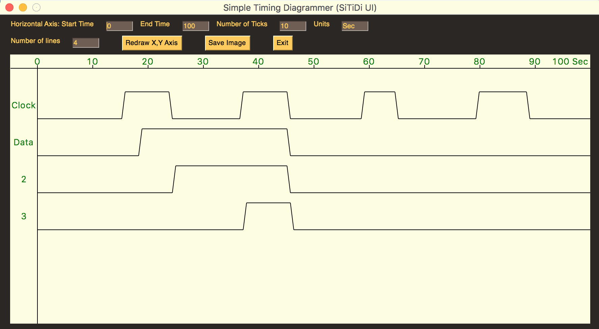

## SiTiDiUI is a Simple Timing Diagram generator, using a GUI.

It is written in Python, using the PySimpleGUI module.

At the moment this is a very basic program but fully functional.

Assuming Python is already installed, add this with a command
such as "python -m install pip -U PySimpleGui". Other modules
include pillow (PIL) and math.

### Creating a timing diagram

The user can click on a timing line and rotate through options of
Low logic level, high level, rising edge and falling edge.

If a high logic level is chosen between a rising edge and falling
edge, then the whole stretch is flipped high. Conversely, if a low
level is selected between a falling edge and rising edge, then the
whole stretch is flipped low.

The units and tick marks on the x axis can changed, the number of
timing lines can be set (1 to 6) and a short title can be given for
each line (click on the default title).

The existing graph can be saved as a GIF. __Note__: the coordinates
for saving the image had to be adjusted for the monitor used during
development, it has not been tested on a variety of monitors. A
backup method is to take a screen shot.

### Needed features

If a user knows Python and Github, they are welcome to help this project!

Missing features:
1. Save/read configuration file, format TBD
1. Test "Save Image" feature on other systems
1. Add a tristate option
1. Add ability to create a sine wave or square wave for a timing line,
with a configurable frequency
1. Be able to add vertical timing marks in the graph
1. Change top area with configuration settings into a pull-down menu.
1. Have an adjustable rise time/fall time
